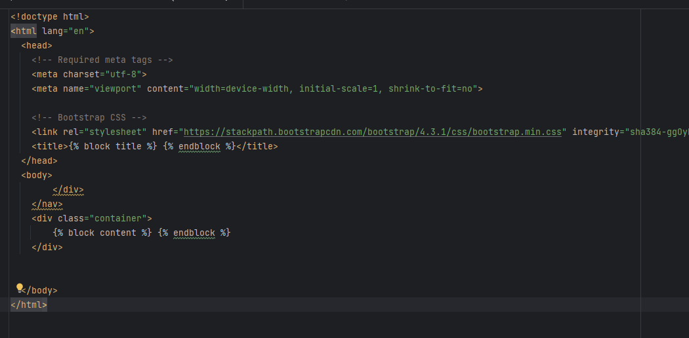

# AppWebTraDatFinal
Aplicación Web de Tratamiento de datos Prueba Final, que consiste en consultar los datos almacenaddos mediante el módulo de extración de la web de wallapop, y posteriormente se crea una web utilizando la libreria Flask, para visualizar lo datos guardados.

### Maestria: Ciber Seguridad
### Módulo: Tratamiento de Datos
### Docente: Rafael Nogales
### Realizado por: Milton Vintimilla Barzallo

**********************************************************
## Instlación de librerias:
pip install -r requeriments.txt

    **Flask==2.3.3**
    **pymongo==4.5.0**
    **python-dotenv==1.0.0**

## Creación de la conexión

Con el módulo *conexion_mongodb.py*, se crea la clase *ConexionMongoDB*

  - Para seguridad en la conexión se crea variables de entorno *.env.*
    cuya configuración es la siguiente:

      **USR_MONGO**= Usuario de la base datos

      **PSW_MONGO**= Clave de la base datos

      **HOS_MONGO**= Nombre del host de conexión 

Con el módulo de *consultadb.py*, realiza todo el proceso de conexión y la consulta 
a la base de datos.

## Páginas web
Para realizar el formulario de búsqueda se requirieron 3 archivos formato html
1. **index.html**, contiene el formulario con los datos a buscar, que son:
    - La descripción del vehículo y,
    - Año de fabricación

2. **base.html**, que sirve de modelo para mostrar lo datos de la consulta

3. **mostrar.html**, página que realiza el proceso de conexión entre el módulo de consulta y la página web

### Resultado de la búsqueda
Extraer lo datos almacenados:

    **Descrpción del vehículo**
    **Foto principal**
    **Año de fabricación**
    **Precio**
    **Recorrido**
    **Motor**
    **Transmisión**
    

